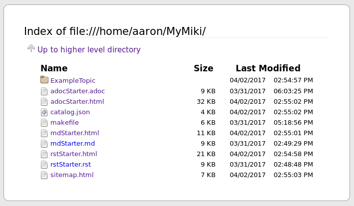
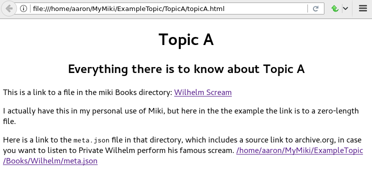

<<<<<<<<<<<<<<<<<<<
Miki: Makefile Wiki
<<<<<<<<<<<<<<<<<<<

Minimal makefile-based personal wiki
<<<<<<<<<<<<<<<<<<<<<<<<<<<<<<<<<<<<

.. meta::
    :description: https://github.com/a3n/miki
     Miki: minimal makefile-based personal wiki.

* Write wiki pages in your preferred markup language.
  All supported types can be in the same wiki.

  * `AsciiDoc
    <https://en.wikipedia.org/wiki/AsciiDoc>`__ (adoc)
  * `Markdown
    <https://en.wikipedia.org/wiki/Markdown>`__ (md)
  * `reStructuredText
    <https://en.wikipedia.org/wiki/ReStructuredText>`__ (rst)

* Run ``make`` to output some or all of:

  * html
  * pdf
  * plain text

  * Also generates:

    * ``sitemap.html`` for the whole wiki.
    * ``catalog.json`` of any book/media files in your wiki.

* Read your wiki pages.

No software provided, just a ``makefile`` and two convenience scripts.
Relies on existing tools that you already have or are easy to install.
You don't have to run the individual tools;
the ``makefile`` does that for you.

    Here's how to generate all html pages in your wiki:

::

  $ mwk # One of the two convenience scripts; runs the makefile.

No templates provided.
Your wiki pages will look very much like the page that you're reading now.
`It's 1992! <http://info.cern.ch/hypertext/WWW/TheProject.html>`__

Don't bother writing and maintaining navigation pages
(the nice, convenient lists of pages you see on any standard wiki),
just use the browser to navigate directories and files.
In essence, the file system is your wiki,
and it's always up to date.

I bookmark the top *directory* of my wiki.
That's my front/top wiki page.

* You see a listing of directories and files.
* I see a menu of topics and pages.

   The top of MyMiki, as seen in Firefox

.. contents::

Get Started
===========

Prerequisites
-------------

I believe everything here is easily installable,
via *apt-get*, *yum*, *Synaptic* and click-click-click, etc.

* A good plain text editor, i.e. a programmer's editor.
  I prefer *Vim*. *Emacs* is equally good.
  There is probably a more recent good editor in the CoolKids Collection™.

  * A bare-bones basic text editor will work too,
    but won't be nearly as fun or useful.

* A browser. I prefer *Firefox*. *Chrome(ium)* is good.

  * These addons are highly recommended,
    to easily move up and down your wiki's URLs:

    * *Firefox*: `Uppity
      <https://addons.mozilla.org/en-US/firefox/addon/uppity/>`__
      I use this all the time, for *Miki*, and the web in general.
      Still works for me, but might be abandoned.
      I'd try this first.
    * *Firefox*: `Navigate Up WE
      <https://addons.mozilla.org/en-US/firefox/addon/navigate-up-we/>`__
      Similar to *Uppity*, has a recent update in December 2016.
    * *Chrome*: `Up
      <https://chrome.google.com/webstore/detail/up/iohgglcbddjknnemakghbjadinmopafl>`__
      (Similar to *Uppity*.)
  * These addons are suggested, but not essential,
    to nicely display json files:

    * *Firefox*: `JsonView <https://addons.mozilla.org/en-US/firefox/addon/jsonview>`__
      (Pretty good.)
    * *Chrome*: `Chrome port of JsonView <https://chrome.google.com/webstore/detail/jsonview/chklaanhfefbnpoihckbnefhakgolnmc>`__
      (Not as good as FF *JsonView*, better than nothing.)

* *Linux*.
* *Gnu make*.
* *lynx*, for html to text generation.
* *jq*, for ``meta.json`` to ``catalog.json`` generation.
* *tree*, for generating ``sitemap.html``.

* *AsciiDoc*-specific:

  * ``asciidoc``, for adoc to html generation.

    * ``asciidoc`` package includes ``a2x``.

  * ``dblatex``, with ``a2x``, for adoc to pdf generation.

* *Markdown*-specific.

  * ``pandoc``, for markdown to html generation.
  * *latex*, for md to pdf generation.

    * The names of packages on your system may differ.
    * ``texlive-latex-base``.
    * ``texlive-latex-extra``.
    * ``lmodern``.

* *reStructuredText*-specific.

  * ``docutils``, for ``rst2html``.
  * ``rst2pdf``, for ``rst2pdf``.

What if I only use one of the supported markup languages?
.........................................................

If you know that you'll only use *Markdown*, for example,
and have no interest in the other markup languages, then:

* Don't install the markup-specific tools that you aren't using.
  (They're listed as such above.)
* Don't copy those markup-specific starter files to your wiki:

  * They're each essentially duplicates of each other,
    written in their respective markup languages.

    * adocStarter.adoc
    * mdStarter.md
    * rstStarter.rst

* Don't copy ``ExampleTopic`` to your wiki.
* Don't create any files that end in a markup suffix that you don't use.

*Miki* looks for all files
that end in the suffix of any supported markup language,
and then uses that list to decide what toolchains to call.

If you don't have any ``.adoc`` files, for example,
then the *AsciiDoc* tools won't be called, and everyone gets out alive.

Or you could install the tools anyway,
and try stuff out when you have a chance.

Installation
------------

* Recommended: ``git clone`` this repo, or download its zip and extract.

  * Or, very minimally, download these files:

    * ``makefile``
    * ``mwk``
    * ``newmeta``
    * ``adocStarter.adoc``
    * ``rstStarter.rst``
    * ``mdStarter.md``

* Create a directory for your wiki.
  I use ``~/MyMiki/`` for these examples.
  You can name yours anything, anywhere.

::

  $ mkdir ~/MyMiki/

* Configure the ``MWK`` environment variable to point to your wiki.
  The ``makefile`` and the two convenience scripts require it.

  * Put the following in your ``.bashrc`` or other shell's startup script,
    then start a new shell or terminal tab so that it takes effect.
  * The name (left hand side) must be ``MWK``.
    The value (right hand side) is
    whatever directory you'll use for your wiki.

::

  $ cat ~/.bashrc
  ...
  export MWK=~/MyMiki # Or wherever you created your wiki directory.
  ...

* Copy the two convenience scripts to a directory on your path.

  * I use ``~/bin/`` for my personal shell scripts.

::

  $ cd /place/where/you/downloaded/or/cloned/the/files/
  $ cp mwk newmeta ~/bin/. # Or wherever you keep your personal shell scripts.
  $ cd ~/bin/
  $ chmod ug+x mwk newmeta # Make them executable.

* Copy ``ExampleTopic``, the ``makefile``,
  and the markup starter files to your wiki.

  * The markup starter files are each an example
    of the markup languages supported.
  * You can read them for details of how to write links
    (I recommend running ``mwk``, so you can read the orignal
    markup files and compare them to their html output.)
  * You can copy them to new files for an easy start on a new file.

::

  $ cd /place/where/you/downloaded/or/cloned/the/files/
  $ cp -r ExampleTopic makefile adocStarter.adoc mdStarter.md rstStarter.rst $MWK/.

* NOTE: ``$MWK/ExampleTopic/`` is for demo/test.

  * I recommend that you do not add any of your own files under that topic.
  * Start your own topic directories directly under ``$MWK``.
  * You can leave ``ExampleTopic`` in your wiki,
    or delete it when you don't need the example anymore.

Check the Installation
----------------------

::

  $ echo $MWK
  /home/aaron/MyMiki

  $ which mwk newmeta
  /home/aaron/bin/mwk
  /home/aaron/bin/newmeta

  # NOTE: The pdf and other resource files under Books are empty
  # placeholder files; I'm not distributing other peoples' files.

  $ cd $MWK

  $ tree
  .
  ├── adocStarter.adoc
  ├── ExampleTopic
  │   ├── Books
  │   │   ├── BeejsGuides
  │   │   │   ├── beej.us
  │   │   │   │   └── guide
  │   │   │   │       └── bggdb
  │   │   │   │           └── index.html
  │   │   │   ├── bgc_USLetter.pdf
  │   │   │   ├── bgipc_USLetter.pdf
  │   │   │   ├── bgnet_USLetter.pdf
  │   │   │   └── meta.json
  │   │   ├── DailyAffirmation
  │   │   │   └── meta.json
  │   │   ├── DeepCSecrets
  │   │   │   ├── Linden_-_Expert_C_Programming__Deep_C_Secrets.pdf
  │   │   │   └── meta.json
  │   │   ├── TenStepsToLinuxSurvival
  │   │   │   ├── meta.json
  │   │   │   └── ten-steps-to-linux-survival.pdf
  │   │   └── Wilhelm
  │   │       ├── meta.json
  │   │       └── WilhelmScream.mp3
  │   ├── TopicA
  │   │   └── topicA.rst
  │   ├── TopicX
  │   │   ├── mdTopicX.md
  │   │   └── rstTopicX.rst
  │   └── UnnecessaryNavigationFile.rst
  ├── makefile
  ├── mdStarter.md
  └── rstStarter.rst

  12 directories, 20 files

  $ make --version
  GNU Make 4.1 # Any recent version is fine, but it should be Gnu.
  Built for x86_64-pc-linux-gnu
  ...

  $ which lynx jq
  /usr/bin/lynx
  /usr/bin/jq

  $ which rst2html rst2pdf
  /usr/bin/rst2html
  /usr/bin/rst2pdf

  $ which pandoc latex pdftex
  /usr/bin/pandoc
  /usr/bin/latex
  /usr/bin/pdftex

  $ which asciidoc a2x dblatex
  /usr/bin/asciidoc
  /usr/bin/a2x
  /usr/bin/dblatex

How To
======

Generate output files
---------------------

You use ``mwk`` to generate your html and other output files.
``mwk`` in turn calls ``make``, which (re)generates whatever output file
is missing or older than its updated markup file.

You can run ``mwk`` from any directory on your system,
as long as you have properly set the ``MWK`` environment variable.

::

  $ mwk clean # Remove all generated files.

  $ mwk print # Do nothing but print to the terminal
              # all rst, md and meta.json source files found,
              # and all corresponding targets based on source.

  $ mwk # Default target is html, catalog and sitemap. The most common invocation.

  $ mwk html # Generate html, catalog and sitemap targets.

  $ mwk catalog # Just generate the catalog.

  $ mwk sitemap # Just generate the sitemap.

  $ mwk pdf # Just generate pdf output files from rst and md files.

  $ mwk text # Generate html files, and then text files from those.

  $ mwk all # Generate all output file types.

  $ mwk -B [target] # Force generation, regardless of up to dateness.
                    # Options like -B are passed through to make.

  $ mwk badlinks # Look for local links in local files that are invalid.
                 # Very handy after moving topics around.

  $ mwk goodlinks # Look for local links in local files that are valid.
                  # Not as useful as badlinks. I never use it.

Read and navigate Miki
----------------------

You know how wikis work, and how the web works in general.
You write links in pages, and you follow them.

You do the same with *Miki*,
but I recommend not writing pages, or parts of pages,
that are mostly navigational.
"This is what's here" is what the Topic/Directory display
in your browser is for, and it's already there.

Don't write pages about your pages, just write your pages,
and read them. Your browser will tell you where they are,
right away and always.

Instead:

* Bookmark the top *directory* of your wiki.

  * Treat that as your front page.
  * Bookmark whatever else you like, of course.

* Make a directory for each major topic at the top of your wiki.

  * Treat the directories as menus.
  * Make subdirectories/subtopics as necessary.

* Write your markup files in the appropriate directories,
  according to topic.

  * After running ``mwk``, the generated html pages are your wiki pages.

See the included $MWK/ExampleTopic/... for example.

Here's the top of MyMiki again:

   The top of MyMiki

If you click on:

* ``Up to higher level directory``

  * Displays the next directory up, in this case my home directory.

* ``Name``, ``Size``, ``Last Modified``

  * Sorts by that parameter.
    Repeat clicks toggle forward and reverse sort.

* Any Topic/Directory:

  * Displays the contents of that directory.

* Any file name:

  * Displays that file,
    in a manner dependent on the file type and your configuration.

    * ``.html`` files will open directly in the browser
      and display properly.
    * Other file types may open in the browser as plain text,
      or the browser may offer to open it in a different application,
      or the browser may automatically open it in a different application.

Now we'll open a blank tab and go directly to
``$MWK/ExampleTopic/TopicA/topicA.html``.

   Topic A page

Say we want to go to ``$MWK/ExampleTopic``. The *Back* button is empty,
there's no path that way. We could go to the bookmark for ``$MWK``
and then go back down to ``ExampleTopic``, but there's no need
because we've installed the *Uppity* addon, or its equivalent.

To get to ``ExampleTopic``, try one of these:

* Click the green "swoosh" arrow (*Uppity*) twice,
  which takes us:

  * Up to ``$MWK/ExampleTopic/TopicA``
  * Up to ``$MWK/ExampleTopic``

* Type *Alt-UpArrow* (comes with *Uppity*) twice,
  which takes us:

  * Up to ``$MWK/ExampleTopic/TopicA``
  * Up to ``$MWK/ExampleTopic``

* Click *Uppity*'s drop-down, then click on the level you want to go up to.

  * *Uppity* shows that we're down at ``.../topicA.html``.
  * I'm hovering over ``.../ExampleTopic/``.
  * If I click, that directory will open, same as the previous two methods.

.. figure:: uppity.png
   :width: 100 %
   :target: uppity.png
   :alt: The current URL chain available

   The current URL chain available

Write Links in your Markup Files
--------------------------------

In your markup source files,
when linking to other files that are generated from markup source files:

::

  file:///home/aaron/MyMiki/ExampleTopic/TopicA/topicA.html

should instead be written as ...

::

  $MWK/ExampleTopic/TopicA/atopicA.adoc
  $MWK/ExampleTopic/TopicA/mtopicA.md
  $MWK/ExampleTopic/TopicA/rtopicA.rst

... depending on what you're linking to.

``mwk`` will translate these to full and proper links.

As long as you link to markup suffixes, e.g. ``.adoc``,
and not final generated suffixes, e.g. ``.html``,
those links will be to:

* ``.html`` in a generated html file.
* ``.pdf`` in a generated pdf file.
* ``.txt`` in a generated txt file.

As long as the front part of links to files in your wiki
is to ``$MWK`` rather than ``file:///...``,
the environment variable will be expanded to its current
value. This makes the URL-writing a bit shorter,
but also you can easily move or rename your wiki's top directory
without combing through your files and fixing links.

Finally, while maintaining your source markup files,
you may want to jump from one markup file to another.
*Vim* and *Emacs* understand environment variables,
and can open the file under the cursor.
Writing your link suffixes to the source files,
rather than the generated files, makes that possible.
Almost like hyperlinks for plain text files.

More complete descriptions of writing links are found in:

* $MWK/adocStarter.adoc and its output files: .html, .pdf, .txt.
* $MWK/mdStarter.md and its output files: .html, .pdf, .txt.
* $MWK/rstStarter.rst and its output files: .html, .pdf, .txt.

Catalog
-------

Have you grown sleepy from reading this far? Take a nap and come back.

::

  L2 use bed.
  Fade to black.
  Wake up with sword.
  ...

*Miki* includes a bare bones book/media catalog tool,
which you don't have to use.

You write a ``meta.json`` file
for each cataloged resource, describing the resource.

When you run ``mwk``, it finds all ``meta.json`` files in the wiki,
wherever they are,
and collects them all into a single ``catalog.json`` file
at the top of the wiki. If you want to post-process ``catalog.json``,
feel free, but it's viewable as-is in the browser.

The included ``newmeta`` script
will create a starter ``meta.json`` file for you:

::

  $ cd $MWK/anywhere/DirectoryThatHasYourBook

  $ newmeta yourbook.pdf

  $ cat meta.json
  {
      "title": "yourbook.pdf",
      "subtitle": "yourbook.pdf",
      "categoryPrimary": "none",
      "categorySecondary": "none",
      "link": "$MWK/anywhere/DirectoryThatHasYourBook/yourbook.pdf",
      "note": "Edit all fields except link and meta.",
      "meta": "$MWK/anywhere/DirectoryThatHasYourBook/meta.json"
  }

You can edit the fields, and add or delete fields as you like.

The following targets will build ``$MWK/catalog.json``.

::

 $ mwk

 $ mwk html

 $ mwk catalog

 $ mwk all

I organize my books and other resource media under a single ``Books``
directory, with one sub-directory per resource,
but that's just a personal and arbitrary choice.

``meta.json`` files don't have to be in the same directory
as their associated resource.
In fact there doesn't even have to be an associated resource,
as you can see below under ``DailyAffirmation``.
In that case I'm just keeping track of a thought,
and the thought is totally contained in the ``meta.json`` file.

::

  $cd $MWK/ExampleTopic

  $ tree -F Books
  Books
  ├── BeejsGuides/
  │   ├── beej.us/
  │   │   └── guide/
  │   │       └── bggdb/
  │   │           └── index.html
  │   ├── bgc_USLetter.pdf
  │   ├── bgipc_USLetter.pdf
  │   ├── bgnet_USLetter.pdf
  │   └── meta.json
  ├── DailyAffirmation/
  │   └── meta.json
  ├── DeepCSecrets/
  │   ├── Linden_-_Expert_C_Programming__Deep_C_Secrets.pdf
  │   └── meta.json
  ├── TenStepsToLinuxSurvival/
  │   ├── meta.json
  │   └── ten-steps-to-linux-survival.pdf
  └── Wilhelm/
      ├── meta.json
          └── WilhelmScream.mp3

Here's ``Wilhelm/meta.json``:

::

  {
      "title": "The Wilhelm Scream",
      "subtitle": "Audio sample",
      "categoryPrimary": "Civilization",
      "categorySecondary": "Audio",
      "link": "$MWK/ExampleTopic/Books/Wilhelm/WilhelmScream.mp3",
      "source": "https://archive.org/details/WilhelmScreamSample",
      "note": "Creative Commons, Public Domain",
      "meta": "$MWK/ExampleTopic/Books/Wilhelm/meta.json"
  }

The only fields that ``mwk catalog`` cares about are:

* "title"
* "categoryPrimary"
* "categorySecondary"

If you use those fields (everything is optional),
it makes sense that they have plain string values as shown,
but they can be any legal json, including arrays and objects.

If you also have a "link" field,
whose value is a link to the book or other resource,
then ``catalog.json`` will include that link,
and you can easily browse your books in ``catalog.json``.

    In *Firefox*,
    the recommended addon JsonView makes the link fields clickable.
    In *Chrome*, I have not found any json viewer addon
    that will make a ``file:`` URL clickable. YMMV.

Read the ``meta.json`` files included with ``ExampleTopic``
for ideas on how to document your resources.

Recent Changes
==============

View the `Closed Issues
<https://github.com/a3n/miki/issues?q=is%3Aissue+is%3Aclosed>`__.
