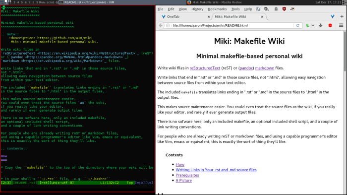

<<<<<<<<<<<<<<<<<<<
Miki: Makefile Wiki
<<<<<<<<<<<<<<<<<<<

Minimal makefile-based personal wiki
<<<<<<<<<<<<<<<<<<<<<<<<<<<<<<<<<<<<

.. meta::
    :description: https://github.com/a3n/miki
	 Miki: minimal makefile-based personal wiki.

Write wiki files in
`reStructuredText <https://en.wikipedia.org/wiki/ReStructuredText>`_ (reST)
or (`pandoc <http://pandoc.org/MANUAL.html#pandocs-markdown>`_)
`markdown <https://en.wikipedia.org/wiki/Markdown>`_ files.
Run ``make`` to generate html, text and/or pdf output files.

Write links that end in ".rst" or ".md" in those source files,
not ".html",
allowing easy navigation between source files
from within your text editor.

The included ``makefile`` translates links ending in ".rst" or ".md"
in the source files to ".html" in the output files.

There is no sofware here, only an included makefile,
an optional included shell script,
and a couple of link writing conventions.

For people who are already writing reST or markdown files,
and using a capable programmer's editor like Vim, emacs or equivalent,
this is exactly the sort of thing they'll like.

.. contents::

How
===

* Copy the ``makefile`` to the top of the directory where your wiki will be.

* In your shell's ``~/.*rc`` file, .e.g. ``~/.bashrc``

  * ``export MWK=/path/to/your/wiki``
  * Then to actually set the variable,
    start a new shell, or do the export in the current shell.
  * Check it: ``$ echo $MWK``

* Write your .rst and/or .md source files.
* Run ``make`` to generate output files.

Since there is only the one ``makefile``,
you need to run ``make`` from the top of your MWK directory,
or ``make -f $MWK/makefile`` from anywhere.

For convenience, put the included optional ``mwk`` script on your path
and make it executable.
You can then run ``mwk clean html``, for example, from anywhere::

  $ cat ~/bin/mwk
  #! /usr/bin/env bash

  make -f $MWK/makefile $*

  $ chmod ug+x ~/bin/mwk

Writing Links in Your .rst and .md source files
===============================================

In your .rst files, instead of writing this::

  Back to `readme <../README.html>`__
  # or
  Back to `readme </path/to/your/wiki/README.html>`__

write this::

  Back to `readme <$MWK/README.rst>`__
  # or
  Back to `readme <$MWK/README.md>`__

* Those are anonymous links (double underscore),
  so that you can write out the same link more than once
  in a .rst file.
* ``$MWK`` at the front is understood by Vim,
  so that you can follow the link in Vim.
* ``$MWK`` is expanded by the ``makefile`` to its value.

In your .md files, instead of writing this::

  Back to [readme](../README.html)
  # or
  Back to [readme](/path/to/your/wiki/README.html)

write this::

  Back to [readme]($MWK/README.rst)
  # or
  Back to [readme]($MWK/README.md)

Note that in a single wiki you might have
both reST and markdown files.
Links to both are handled,
within both kinds of source files.

Prerequisites
=============

* Linux. Probably \*bsd. Maybe cygwin or MacOS.
* make.
* docutils, for rst2html.
* rst2pdf, for rst2pdf.
* lynx, for lynx -dump to make .txt from .html.
* pandoc, for markdown to html generation.
* pandoc and latex, for markdown to pdf generation.
  
  * I installed texlive-latex-base, lmodern,
    and anything else that was complained about while generating files.
  * The names of packages on your system may differ.

A Picture
=========

   Vim and Firefox side by side.
