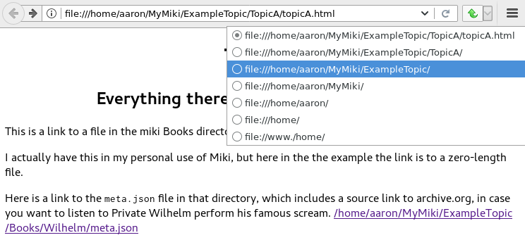

<<<<<<<<<<<<<<<<<<<
Miki: Makefile Wiki
<<<<<<<<<<<<<<<<<<<

Minimal makefile-based personal wiki
<<<<<<<<<<<<<<<<<<<<<<<<<<<<<<<<<<<<

.. meta::
    :description: https://github.com/a3n/miki
	 Miki: minimal makefile-based personal wiki.

* Write wiki pages in `reStructuredText
  <https://en.wikipedia.org/wiki/ReStructuredText>`__ (rst)
  or `Markdown
  <https://en.wikipedia.org/wiki/Markdown>`__ (md).
  Both types can be in the same wiki.
* Run ``make`` to output html, and/or pdf, and/or plain text.

  * Also generates a sitemap for the whole wiki.
  * Optionally catalogs any book/media files in your wiki.

* Read your wiki pages.

No software provided, just a ``makefile`` and two convenience scripts.

No templates provided.
Your wiki pages will look very much like the page that you're reading now.

Relies on existing tools that you already have or are easy to install.

Don't bother writing and maintaining navigation pages
(the nice, convenient lists of pages you see on any standard wiki),
just use the browser to navigate directories.
In essence, the file system is your wiki
(and it's always up to date, by definition),
the browser displays that file system and its pages,
and that's good enough for a personal wiki.

I bookmark the top `directory` of my wiki.
Here's what that looks like in my browser at the moment:

.. figure:: aaronsMiki.png
   :width: 100 %
   :target: aaronsMiki.png
   :alt: The top of my wiki

   The top of my wiki

I will typically click on a topic directory,
and then click on a page,
or drill further down into subtopics.

.. contents::

Get Started
===========

Prerequisites
-------------

* A good plain text editor, i.e. a programmer's editor.
  I prefer Vim. Emacs is equally good.
  There is probably a more recent good editor in the CoolKids Collection™.

  * A bare-bones basic text editor will work too,
    but won't be nearly as fun or useful.

* A browser. I prefer Firefox. Chrome(ium) is good.

  * These addons are highly recommended,
    to easily move up and down your wiki's URLs:

    * Firefox: `Uppity
      <https://addons.mozilla.org/en-US/firefox/addon/uppity/>`__
      I use this all the time, for Miki, and the web in general.
      Still works for me, but might be abandoned.
    * Firefox: `Navigate Up WE
      <https://addons.mozilla.org/en-US/firefox/addon/navigate-up-we/>`__
      Similar to Uppity, has a recent update in December 2016.
    * Chrome: `Up
      <https://chrome.google.com/webstore/detail/up/iohgglcbddjknnemakghbjadinmopafl>`__
      (Similar to Uppity.)
  * These addons are suggested, but not essential,
    to nicely display json files:

    * Firefox: `JsonView <https://addons.mozilla.org/en-US/firefox/addon/jsonview>`__
      (Pretty good.)
    * Chrome: `Chrome port of JsonView <https://chrome.google.com/webstore/detail/jsonview/chklaanhfefbnpoihckbnefhakgolnmc>`__
      (Not as good as FF JsonView, better than nothing.)

* Linux.
* Gnu make.
* lynx, for html to text generation.
* jq, for ``meta.json`` to ``catalog.json`` generation.
* tree, for generating the sitemap.
* reStructuredText-specific.

  * docutils, for rst2html.
  * rst2pdf, for rst2pdf.

* Markdown-specific.

  * pandoc, for markdown to html generation.
  * tex, for md to pdf generation.

    * The names of packages on your system may differ.
    * texlive-latex-base.
    * texlive-latex-extra.
    * lmodern.

Installation
------------

* Recommended: ``git clone`` this repo, or download its zip and extract.
* Or, very minimally, download these files:

  * ``makefile``
  * ``mwk``
  * ``newmeta``
  * ``rstStarter.rst``
  * ``mdStarter.md``

* Create a directory for your wiki.
  I use ``~/MyMiki`` for these examples.
  You can name yours anything, anywhere.

::

  $ mkdir ~/MyMiki

* Configure the ``MWK`` environment variable to point to your wiki.
  The ``makefile`` and the two convenience scripts require it.

  * Put the following in your ``.bashrc`` or other shell's startup script,
    then start a new shell or terminal tab so that it takes effect.
  * The name (left hand side) must be ``MWK``.
    The value (right hand side) is
    whatever directory you'll use for your wiki.

::

  $ cat ~/.bashrc
  ...
  export MWK=~/MyMiki # Or wherever you created your wiki directory.
  ...

* Copy the two convenience scripts to a directory on your path.

  * I use ``~/bin/`` for my personal shell scripts.

::

  $ cd /place/where/you/downloaded/or/cloned/the/files
  $ cp mwk newmeta ~/bin/. # Or wherever you keep your shell scripts.
  $ cd ~/bin
  $ chmod ug+x mwk newmeta # Make them executable.

* Copy ``ExampleTopic``, the ``makefile``,
  and two starter files, to your wiki.

::

  $ cd /place/where/you/downloaded/or/cloned/the/files
  $ cp -r ExampleTopic makefile mdStarter.md rstStarter.rst $MWK/.

* NOTE: ExampleTopic is for demo/test.

  * I recommend that you do not add any of your own files under that topic.
  * Start your own topic directories directly under ``$MWK``.
  * You can leave ExampleTopic in your wiki,
    or delete it when you don't need the example anymore.

Check the Installation
----------------------

::

  $ echo $MWK
  /home/aaron/MyMiki

  $ which mwk newmeta
  /home/aaron/bin/mwk
  /home/aaron/bin/newmeta

  $ ls -1 $MWK
  ExampleTopic
  makefile
  mdStarter.md
  rstStarter.rst

  # NOTE: The pdf and other resource files under Books are empty
  # placeholder files; I'm not distributing other peoples' files.
  #
  $ cd $MWK
  $ tree ExampleTopic
  ExampleTopic
  ├── Books
  │   ├── BeejsGuides
  │   │   ├── beej.us
  │   │   │   └── guide
  │   │   │       └── bggdb
  │   │   │           └── index.html
  │   │   ├── bgc_USLetter.pdf
  │   │   ├── bgipc_USLetter.pdf
  │   │   ├── bgnet_USLetter.pdf
  │   │   └── meta.json
  │   ├── DailyAffirmation
  │   │   └── meta.json
  │   ├── DeepCSecrets
  │   │   ├── Linden_-_Expert_C_Programming__Deep_C_Secrets.pdf
  │   │   └── meta.json
  │   ├── TenStepsToLinuxSurvival
  │   │   ├── meta.json
  │   │   └── ten-steps-to-linux-survival.pdf
  │   └── Wilhelm
  │       ├── meta.json
  │       └── WilhelmScream.mp3
  ├── TopicA
  │   └── topicA.rst
  ├── TopicX
  │   ├── mdTopicX.md
  │   └── rstTopicX.rst
  └── UnnecessaryNavigationFile.rst

  $ make --version
  GNU Make 4.1 # Any recent version is fine, but it should be Gnu.
  Built for x86_64-pc-linux-gnu
  ...

  $ which lynx jq
  /usr/bin/lynx
  /usr/bin/jq

  $ which rst2html rst2pdf
  /usr/bin/rst2html
  /usr/bin/rst2pdf

  $ which pandoc latex pdftex
  /usr/bin/pandoc
  /usr/bin/latex
  /usr/bin/pdftex

Test files
..........

There are now tests to check proper ``$MWK`` setting, in the repo.
They are meant for anyone developing or maintaining Miki,
but an end user could run them if they wanted.

There may be more tests in the future. Testing is good.

``testMWK.sh`` should run to completion,
with a message that all tests passed.
If any test failed, the reason why is printed,
and the script stops there.

Instructions on how to run are in the file,
but basically install Miki and make the test script executable,
then run it from its directory.

::

  $ cd <repoClone>/tests/envVarMWK
  $ chmod ug+x testMWK.sh
  $ ./testMWK.sh

  Test mwk happy paths.
  
  + which mwk
  /home/aaron/bin/mwk
  OK

  ...

  + export MWK=/home/aaron/MWK/makefile
  + MWK=/home/aaron/MWK/makefile
  + newmeta .
  /home/aaron/bin/newmeta: Required: export MWK=~/top/directory/of/your/wiki
  $MWK = "/home/aaron/MWK/makefile"
  OK
  
  All tests PASS

How To
======

Generate output files
---------------------

You use ``mwk`` to generate your html and other output files.
``mwk`` in turn calls ``make``, which (re)generates whatever output file
is missing or older than its source rst or md file.

::

  $ mwk clean # Remove all generated files.

  $ mwk print # Do nothing but print to the terminal
              # all rst, md and meta.json source files found,
              # and all corresponding targets based on source.

  $ mwk # Default target is html, catalog and sitemap. The most common invocation.

  $ mwk html # Generate html, catalog and sitemap targets.

  $ mwk catalog # Just generate the catalog.

  $ mwk sitemap # Just generate the sitemap.

  $ mwk pdf # Just generate pdf output files from rst and md files.

  $ mwk text # Generate html files, and then text files from those.

  $ mwk all # Generate all output file types.

  $ mwk -B [target] # Force generation, regardless of up to dateness.
                    # Options like -B are passed through to make.

  $ mwk badlinks # Look for local links in local files that are invalid.
                 # Very handy after moving topics around.

  $ mwk goodlinks # Look for local links in local files that are valid.
                  # Not as useful as badlinks. I never use it.

* Generate html files.

::

  # You can run mwk from any directory on your system,
  # even outside the wiki, and the files will be generated
  # in their proper places.
  #
  # For the moment, we care about what happens in ExampleTopic,
  # so we'll go there.
  #
  $ cd $MWK/ExampleTopic

  $ mwk clean # Just to be sure we're both starting from zero.
  cleaned

  $ ls -1
  Books
  TopicA
  TopicX
  UnnecessaryNavigationFile.rst

  $ mwk
  ... make output ..

  $ ls -1 ..
  catalog.json
  ExampleTopic
  makefile
  mdStarter.html
  mdStarter.md
  rstStarter.html
  rstStarter.rst
  sitemap.html

  $ ls -1
  Books
  TopicA
  TopicX
  UnnecessaryNavigationFile.html
  UnnecessaryNavigationFile.rst

* New files: 

  * ``catalog.json`` at the top of the wiki.
  * ``sitemap.html`` at the top of the wiki.
  * New html files wherever an rst or md file is found.

    * (The ``index.html`` file below was already there,
      it's not based on an rst or md file.)

::

  $ find .. -name "*.html" -o -name "catalog.json" |sort
  ../catalog.json
  ../ExampleTopic/Books/BeejsGuides/beej.us/guide/bggdb/index.html
  ../ExampleTopic/TopicA/topicA.html
  ../ExampleTopic/TopicX/mdTopicX.html
  ../ExampleTopic/TopicX/rstTopicX.html
  ../ExampleTopic/UnnecessaryNavigationFile.html
  ../mdStarter.html
  ../rstStarter.html
  ../sitemap.html

Read and navigate Miki
----------------------

You know how wikis work, and how the web works in general.
You write links in pages, and you follow them.

You do the same with Miki,
but I recommend not writing pages, or parts of pages,
that are mostly navigational.

Instead, use your browser to navigate directories,
and click on files when you get there.
Directory listings are always up to date,
and you'll have to fix fewer broken links when you move things around.

My suggestion:

* In your browser, bookmark the top `directory` of your wiki,
  whatever the value of ``$MWK`` is,
  rather than a page in the top directory.

* In ``$MWK``, create a directory for each topic,
  and subdirectories for subtopics.

  * Create whatever rst or md source files you need
    in your topic directories.
  * Write links that are relevant to your topic
    in your source files.

    * In my opinion, "the top of my main wiki"
      is not relevant to your topic.
    * But a link to another page within the topic may be useful.
  * Copy in any external files that you need:
    html, pdf, media files, images, etc.

* Click down through the topic directories and pages as needed.

``mwk`` generates a sitemap,
at ``$MWK/sitemap.html``.
All files and directories in the wiki are listed and clickable.

For moving up and down from where you happen to be,
here's where the Firefox Uppity addon,
or the Chrome Up addon, shows its worth.

Drill down to a page somewhere down in your wiki.
Now decide to go to the top of the wiki
(or anywhere in between, if you like).

I'll go to a page in ``ExampleTopic/TopicA``.
There's no purely navigational link on the page,
and specifically no link to the top of the wiki.

You could repeatedly click the back button,
and depending on the route you took to get to this file,
you might end up where you want. Or not.

Uppity/Up lets you move up the URL levels,
similar to moving up in a file manager.

   The current URL exposed

* I'm viewing ``topicA.html``.
* I want to go to the top of the wiki.
* Click on Uppity's dropdown, next to the green swoop arrow.

  * We're down at ``topicA.html`` in the URL.
  * All URL levels are available to choose.
  * I've moved the mouse to ``.../MyMiki``.
  * If I click there, that directory will be displayed.

If you click on the green swoop arrow itself, instead of the dropdown,
Uppity will immediately move you up one URL level.

Write links in your rst and md source files
-------------------------------------------

In your rst and md source files,
when linking to html files that are generated from rst or md files,

::

  ``file:///home/aaron/MyMiki/ExampleTopic/TopicA/topicA.html``

should instead be written as

::

  ``$MWK/ExampleTopic/TopicA/topicA.rst``.

or

::

  ``$MWK/ExampleTopic/TopicA/topicA.md``.

depending on whether the generated html file
is based on an rst or md source file.

``mwk`` will translate these to full and proper ``.html`` links
in the generated html files.

You write links to generated files with ``.md`` or ``.rst`` endings
so that you can jump from source file to source file in your text editor.
In Vim, for example, put the cursor on a file name, then ``gf``
will open that file in Vim. You probably want to go to the rst or md file,
not the generated html or pdf file.

You replace ``file:///path/to/my/wiki`` with ``$MWK``
because it's easier to write,
and you'll be able to move your wiki to another directory or machine
without link breakage. Vim understands the environment variable,
and will happily open the rst or md file.

* In your rst files,
  write your links to other wiki pages/files like this:

::

  # Link to one of your rst source files.
  # This will be turned into an html link in the generated html file.
  #
  `Topic A <$MWK/ExampleTopic/TopicA/topicA.rst>`__
  (that's two underscores at the end)

  # Link to a pdf file that you've copied in.
  #
  `Some pdf <$MWK/ExampleTopic/TopicA/somePdf.pdf>`__

  # Link to an html file that you've copied in.
  #
  `html file that you copied in, not based on an rst file
  <$MWK/ExampleTopic/TopicA/copiedExternal.html>`__

  `External web page <https://en.wikipedia.org/wiki/Main_Page>`__

* You can also link to md files from an rst file:

::

  `Topic M <$MWK/ExampleTopic/TopicM/topicM.md>`__
  (We're in an rst file, so we write rst style links.)

* In your md files,
  write your links to other wiki pages/files like this:

::

  # Link to one of your md source files.
  # This will be turned into an html link in the generated html file.
  #
  [Topic Z]($MWK/ExampleTopic/TopicZ/topicZ.md>)

  # Link to a pdf file that you've copied in.
  #
  [Some pdf]($MWK/ExampleTopic/TopicZ/topicZ.pdf>)

  # Link to an html file that you've copied in.
  #
  [html file that you copied in, not based on an md file]($MWK/ExampleTopic/TopicZ/copiedExternal.html>)

  [External web page](https://en.wikipedia.org/wiki/Main_Page)

* You can also link to rst files from an md file:

::

  [Topic T]($MWK/ExampleTopic/TopicT/topicT.rst>)
  (We're in an md file, so we write md style links.)

Still not clear?
Run ``mwk``, then compare a ``.rst`` file
with its generated ``.html`` file,
and see how ``$MWK`` and ``.rst`` in the rst file
get changed to proper links in the html file.

Do the same comparison between a ``.md`` file
and its generated ``.html`` file.

Catalog
-------

Have you grown sleepy from reading this far? Take a nap and come back.

::

  L2 use bed.
  Fade to black.
  Wake up with sword.
  ...

Miki includes a bare bones book/media catalog tool,
which you don't have to use.

Each cataloged resource has an associated ``meta.json`` file
describing the resource.
When you run ``mwk``, it looks for all ``meta.json`` files in the wiki
and collects them all into a single ``catalog.json`` file
at the top of the wiki.

I wrote it because I found it convenient to keep my book and
other resource files within Miki, to link to them,
and I wanted a single listing of all my resources.
And now that I have that single listing,
I find it convenient to keep all my books there,
whether I link to them or not.

The included ``newmeta`` script
will create a starter ``meta.json`` file for you:

::

  $ cd $MWK/anywhere/DirectoryThatHasYourBook
  
  $ newmeta yourbook.pdf

  $ cat meta.json
  {
      "title": "yourbook.pdf",
      "subtitle": "yourbook.pdf",
      "categoryPrimary": "none",
      "categorySecondary": "none",
      "link": "$MWK/anywhere/DirectoryThatHasYourBook/yourbook.pdf",
      "note": "Edit all fields except link and meta.",
      "meta": "$MWK/anywhere/DirectoryThatHasYourBook/meta.json"
  }

The following targets will build ``$MWK/catalog.json``.

::

 $ mwk

 $ mwk html

 $ mwk catalog

 $ mwk all

``$MWK/catalog.json`` is generated at the very top of the wiki,
regardless of where in the wiki the ``meta.json`` files are found.

I organize my books and other resource media under a single ``Books``
directory, with one directory per resource.
As long as it's in your wiki, the name or location of your
resource directory doesn't matter.
In fact you don't have to keep all your cataloged resources in one
directory; scatter them throughout your wiki if you like.

::

  $cd $MWK/ExampleTopic
  
  $ tree -F Books
  Books
  ├── BeejsGuides/
  │   ├── beej.us/
  │   │   └── guide/
  │   │       └── bggdb/
  │   │           └── index.html
  │   ├── bgc_USLetter.pdf
  │   ├── bgipc_USLetter.pdf
  │   ├── bgnet_USLetter.pdf
  │   └── meta.json
  ├── DailyAffirmation/
  │   └── meta.json
  ├── DeepCSecrets/
  │   ├── Linden_-_Expert_C_Programming__Deep_C_Secrets.pdf
  │   └── meta.json
  ├── TenStepsToLinuxSurvival/
  │   ├── meta.json
  │   └── ten-steps-to-linux-survival.pdf
  └── Wilhelm/
      ├── meta.json
          └── WilhelmScream.mp3

I don't use category directories, like, say, `Books/Science/`,
with all science book directories under there;
that way lies madness and maintenance.
All organization is done in the ``catalog.json`` generated file,
based on categories in the individual ``meta.json`` files.

If you keep your book directories in one overall directory,
then you can think of it like this:

* The Books directory is like a sql table.
* Each book directory under Books is a record.
* The fields in ``meta.json`` are columns.
* The link field points to a binary blob.
* The title field is (very loosely) the primary key.
* The category fields are foreign keys
  to the sections in ``catalog.json`` where those categories end up.

Here's ``Wilhelm/meta.json``:

::

  {
      "title": "The Wilhelm Scream",
      "subtitle": "Audio sample",
      "categoryPrimary": "Civilization",
      "categorySecondary": "Audio",
      "link": "$MWK/ExampleTopic/Books/Wilhelm/WilhelmScream.mp3",
      "source": "https://archive.org/details/WilhelmScreamSample",
      "note": "Creative Commons, Public Domain",
      "meta": "$MWK/ExampleTopic/Books/Wilhelm/meta.json"
  }

The only fields that ``mwk catalog`` cares about are:

* "title"
* "categoryPrimary"
* "categorySecondary"

If you use them (everything is optional),
those three fields `should` have plain string values as shown,
but they can be any legal json, including arrays and objects.
``mwk`` will cause all objects from all found ``meta.json`` files
to be collected in a single ``catalog.json`` file,
sorted by title and grouped by categories.

If you also have a "link" field,
whose value is a link to the book or other resource,
then ``catalog.json`` will include that link,
and you can easily browse your books in ``catalog.json``.

    In Firefox,
    the recommended addon JsonView makes the link fields clickable.
    In Chrome, I have not found any json viewer addon
    that will make a ``file:`` URL clickable. YMMV.

Every field in a ``meta.json`` object is optional,
and you can add new fields.
The only requirement is that everything inside an object must be valid json.

* Read the ``meta.json`` files included with ``ExampleTopic``
  for ideas on how to document your resources.

::

  $cd $MWK/ExampleTopic
  
  $ tree -F Books 
  Books
  ├── BeejsGuides/
  │   ├── beej.us/
  │   │   └── guide/
  │   │       └── bggdb/
  │   │           └── index.html
  │   ├── bgc_USLetter.pdf
  │   ├── bgipc_USLetter.pdf
  │   ├── bgnet_USLetter.pdf
  │   └── meta.json

There are four resources in ``BeejsGuides``,
the three pdfs and the html that you see above.
They are all tracked in the single ``meta.json`` file,
with four json objects.

::

  $ cat Books/BeejsGuides/meta.json
  {
      "title": "Beej's Quick Guide to GDB",
      "categoryPrimary": "Software",
      "categorySecondary": "C",
      "link": "$MWK/ExampleTopic/Books/BeejsGuides/beej.us/guide/bggdb/index.html",
      "source": "http://beej.us/guide/bggdb/",
      "meta": "$MWK/ExampleTopic/Books/BeejsGuides/meta.json"
  }
  {
      "title": "Beej's Guide to C Programming",
      "subtitle": "Rough draft",
      "categoryPrimary": "Software",
      "categorySecondary": "C",
      "link": "$MWK/ExampleTopic/Books/BeejsGuides/bgc_USLetter.pdf",
      "source": "http://beej.us/guide/bgc/",
      "meta": "$MWK/ExampleTopic/Books/BeejsGuides/meta.json"
  }
  {
      "title": "Beej's Guide to Unix IPC",
      "categoryPrimary": "Software",
      "categorySecondary": "C",
      "link": "$MWK/ExampleTopic/Books/BeejsGuides/bgipc_USLetter.pdf",
      "source": "http://beej.us/guide/bgipc/",
      "meta": "$MWK/ExampleTopic/Books/BeejsGuides/meta.json"
  }
  {
      "title": "Beej's Guide to Network Programming",
      "subtitle": "Using Internet Sockets",
      "categoryPrimary": "Software",
      "categorySecondary": "C",
      "link": "$MWK/ExampleTopic/Books/BeejsGuides/bgnet_USLetter.pdf",
      "source": "http://beej.us/guide/bgnet/",
      "meta": "$MWK/ExampleTopic/Books/BeejsGuides/meta.json"
  }

Note that the four top-level json objects in ``meta.json``
are `not` separated by commas.
Everything `within` a top level object must be legal json,
but the object(s) at the top of a ``meta.json`` file
are free floating in the universe until ``mwk``
collects them into an array in ``catalog.json``.

::

  ├── DailyAffirmation/
  │   └── meta.json

This ``meta.json`` file does not track a file on disk,
it just tracks a thought, contained in ``meta.json`` as a note.
It shows up in ``$MWK/catalog.json`` like any other tracked resource.

::

  ├── DeepCSecrets/
  │   ├── Linden_-_Expert_C_Programming__Deep_C_Secrets.pdf
  │   └── meta.json
  ├── TenStepsToLinuxSurvival/
  │   ├── meta.json
  │   └── ten-steps-to-linux-survival.pdf

These two ``meta.json`` files each track a single pdf file.

::

  └── Wilhelm/
      ├── meta.json
      └── WilhelmScream.mp3

This ``meta.json`` file tracks an mp3 file.
